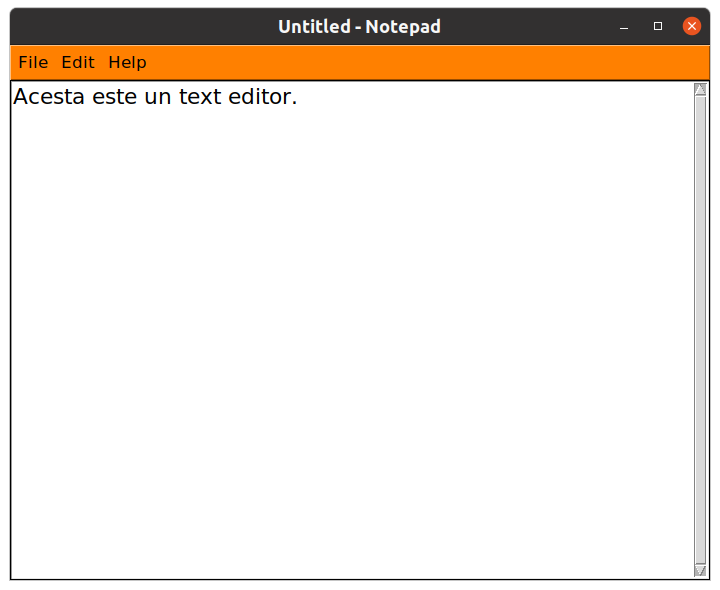

#Python Notepad using Tkinter
 
A replication of windows notepad using tkinter python GUI library

```python
#!/usr/bin/python3
# -*- coding: utf-8 -*-
# FILE : __main__.py
# RUN  : python3 __main__.py
```

#### =========================================
### Function to italic text
#### =========================================
```
def italic():
    text.config(font=('Segio UI',20,'italic'))
```
#### ================================
### Function to underline text
#### ================================
```
def underline():
    text.config(font=('Segio UI',20,'underline'))
``` 

### Adding function to print hour
```
 def ora(self):
        ora=time.localtime()
        self.text_area.insert(tk.INSERT, ora)
```
Access: Edit>Insert hour

### Adding function to print a line
```
def line():
    line="-"*60
    self.text_area.insert(tk.INSERT, line)
```
Access: Edit>Insert line

### Adding the datetime module
```import datetime```

Create the function date():
```python
def date(self):
    data = datetime.date.today()
    self.text_area.insert(tk.INSERT, data)
```
Access: Edit>Insert date


[](LICENSE)


## Table of Content

* [Prerequisites](#prerequisites)

* [Getting started](#getting-started)

* [Run Notepad](#run-notepad)

* [Build with](#build-with)

* [Author](#author)


## Prerequisites

* **Python 3** 
* **tkinter** - Tkinter comes pre-installed with the Python installer binaries for Mac OS X and the Windows platform. So if you install Python from the official binaries for Mac OS X or Windows platform, you are good to go with Tkinter.

    For Debian versions of Linux you have to install it manually by using the following commands.

    For Python 3, `sudo apt-get install python3-tk`

    
## Getting started

Clone the repository to your local machine using,
 
```
~$ git clone https://github.com/Ayan-Kumar-Saha/tkinter-Notepad.git
```

## Run Notepad

Run the notepad using,

### Linux and macOS

```
~$ python3 notepad.py
```

### Windows

```
~$ python notepad.py
```

## Build with

* [tkinter](https://docs.python.org/3/library/tkinter.html) - A python library for creating GUI-based application. 

## Author

**Ayan Kumar Saha**
* [GitHub](https://github.com/Ayan-Kumar-Saha)
* [LinkedIn](https://www.linkedin.com/in/ayankumarsaha/)
